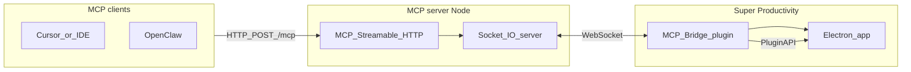

# Architecture

1. **MCP clients** call tools over **Streamable HTTP** (`/mcp`).
2. The **Node server** forwards work to the **plugin** via **Socket.IO** (plugin connects outbound to the server URL).
3. The **plugin** uses **Super Productivity Plugin API** (`getTasks`, `addTask`, etc.) against the running app.

Data stays in Super Productivity’s local store (and optional sync you configure there). The MCP server is a bridge, not a second database.
